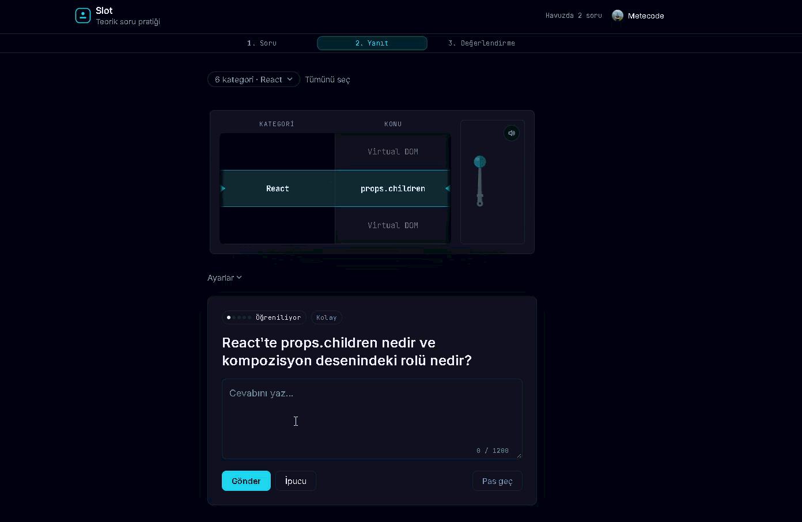

<div align="center">

# 🎰 Slot

**Teknik mülakat sorularına slot makinesini kullanarak hazırlan.**

Kategorini seç, kolu çek, ekrana düşen soruyu kendi cümlelerinle yanıtla. 

[**Canlı Demo**](https://slot.meteucar.com/) · [Hata Bildir](https://github.com/Metecode/slot-study/issues/new) · [Soru Öner](https://github.com/Metecode/slot-study/issues/new)




</div>

---

## Neden Yaptım?

Mülakatlara hazırlanırken hepimizin yaşadığı klasik bir sorun var: "Virtual DOM nedir?" veya "Transaction propagation türleri nelerdir?" gibi soruları ekrandan okuyup *“Ha tamam bunu biliyorum”* diyip geçmek çok kolay. Ama iş sesli olarak ya da yazıyla **kendi cümlelerinle** anlatmaya geldiğinde bazen tıkanabiliyoruz.

Konseptleri sadece ezberlemek yerine ifade etme pratiği yapabilmek için bu süreci biraz oyunlaştırmak istedim. Slot'un mantığı basit: Sana rastgele bir soru fırlatır, sen aklındakini dökersin, sonra örnek cevapla kendi yazdığını kıyaslarsın.

## Nasıl Kullanırsın?

1. **Kategorini seç** — Frontend, SQL, Algoritmalar veya hepsi karışık.
2. **Kolu çek** — Makaralar dönsün ve şansına bir soru gelsin.
3. **Cevabını yaz** — Konuyu kendi anladığın şekilde, kendi cümlelerinle özetle.
4. **Kendini değerlendir** — Uygulama cevabındaki kritik terimleri yakalar. Örnek cevabı okuyup kendine dürüstçe bir puan ver.
5. **Kutunu belirle** — İşin içine Leitner sistemi giriyor; zorlandığın soruları ilgili kutuya atarsan karşına daha sık çıkarlar.
6. **Yapay zekaya danış** — "Ben bunu pek anlamadım" dersen, soru ve senin cevabını içeren hazır bir prompt panoya kopyalanır. Gidip istediğin AI aracına (ChatGPT, Claude vb.) yapıştırıp detay isteyebilirsin.

## Öne Çıkanlar

- 🎰 **Slot Animasyonu:** Soru seçmeyi biraz daha keyifli hale getiren makara ve kol mekaniği.
- ✅ **Anahtar Kelime Avcısı:** Cevabındaki kritik kavramları yakalayıp sana ipucu verir.
- 📦 **Leitner Sistemi (Aralıklı Tekrar):** Neyi ne kadar iyi bildiğine sen karar verirsin, sistem de zorlandıklarını sana daha sık hatırlatır.
- 🔒 **Local-first (Önce Yerel):** Kullanmak için hesap açmana gerek yok. Tüm ilerlemen doğrudan tarayıcında (IndexedDB) tutulur.
- 🔄 **Cihazlar Arası Senkron:** Eğer GitHub ile giriş yaparsan, ilerlemen arka planda sunucuyla eşitlenir. Telefondan devam edebilirsin.
- 🤖 **Yapay Zekaya Bağımlı Değil:** Uygulamanın asıl değeri kaliteli soru-cevap havuzunda. AI sadece işin opsiyonel destek kısmı.

## Mimari Nasıl Çalışıyor?

Slot **local-first** bir mimariyle geliştirildi. Yani uygulamayı indirip backend olmadan, tamamen hesapsız bir şekilde eksiksiz kullanabilirsin. Backend, sadece giriş yapan kullanıcıların cihazlar arası senkronizasyonunu sağlamak için ikinci bir kopya tutar.

```text
Tarayıcı (IndexedDB)  ── Birincil kopya (Her zaman önce buraya yazılır)
        │
        │  Senkron tetikleyiciler: giriş yapma, soru puanlama, sekme kapatma
        ▼
Spring Boot API  ──►  PostgreSQL  ── İkinci kopya (Sadece giriş yapanlar için)
```

- **Çevrimdışı dayanıklılık** — Backend'e ulaşılamazsa senkronizasyon sessizce iptal olur, yereldeki verin güvendedir. İnternet gelince tekrar dener.
- **Veri Birleştirme (Merge):** — İki farklı cihazda çalışırsan, kutu ve son görülme tarihi için en güncel olanı baz alır, yazdığın cevapları ise kayıpsız birleştirir.
- **Güvenlik** — GitHub OAuth kullanır. Kısa ömürlü JWT access token bellekte, refresh token ise HttpOnly cookie'de tutulur.

## Teknoloji

| Katman | Araçlar |
| --- | --- |
| Frontend | React 19, TypeScript, Vite, Tailwind CSS v4, shadcn/ui, Zod |
| Yerel depolama | IndexedDB (idb-keyval) |
| Backend | Spring Boot 4, Java 21, Spring Security (OAuth2 + JWT) |
| Veritabanı | PostgreSQL, Flyway |
| Test | Vitest, JUnit, Testcontainers |
| Altyapı | Docker, GitHub Actions |

## Projeyi Ayağa Kaldırma

### Sadece Frontend (Backend olmadan)

Uygulama backend olmadan da gayet güzel çalışıyor.

**Gereksinimler:** Node.js 20+

```bash
git clone https://github.com/Metecode/slot-study.git
cd slot-study
npm install
npm run dev
```

Uygulama `http://localhost:5173` adresinde açılır.

### Backend ile Birlikte Çalıştırma

**Gereksinimler:** Java 21, Docker

```bash
cp .env.example .env          # veritabanı ve JWT ayarlarını doldur
docker compose up -d          # PostgreSQL
cd backend
./mvnw spring-boot:run        # Windows: .\mvnw.cmd spring-boot:run
```

Vite tarafı, `/api` isteklerini otomatik olarak `localhost:8080`'e yönlendirir (proxy). Frontend'de ekstra bir ayar yapmana gerek yok.

## Yol Haritası

- [x] **Faz 1** — Local-first web uygulaması, slot mekaniği, anahtar kavram eşleşmesi
- [x] **Faz 2** — GitHub ile giriş, cihazlar arası ilerleme senkronu, kendi sunucusunda yayın
- [ ] Android ve iOS uygulamaları

## Destek ve Katkı

Bu projenin en çok ihtiyaç duyduğu şey **kaliteli yeni sorular ve sağlam örnek cevaplar**.

Yeni bir soru eklemek, hatalı olduğunu düşündüğün bir cevabı düzeltmek ya da yepyeni bir kategori açmak için Issue oluşturabilir veya doğrudan PR gönderebilirsin:

1. Repoyu fork'la
2. Yeni bir dal aç: `git checkout -b soru/redis-eviction`
3. Değişikliklerini commit'le
4. Pull request aç

## Lisans

Bu repo iki farklı lisansla korunmaktadır:

- **Kaynak kod** — [MIT](LICENSE)
- **Soru ve cevap içeriği** (`src/content/`) — [CC BY-SA 4.0](src/content/LICENSE)

İçerikleri dilediğin gibi kullanabilir, değiştirebilir ve paylaşabilirsin. Sadece kaynağı (bu repoyu) belirtmen ve türettiğin işleri de aynı lisansla paylaşman yeterli.

---

<div align="center">

[Mete Uçar](https://meteucar.com) tarafından geliştirildi.

Projeyi faydalı bulduysan bir ⭐'ını alırım.

</div>
